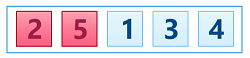
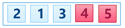
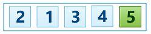
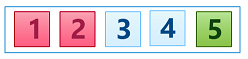
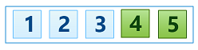

## Bubble Sort
Today we are going to look at one of the elementary sorting algorithm - [Bubble Sort][]. This is usually the first sorting algorithm taught because it is the easiest one to conceptually understand and implement. But keep in mind that it's also one of the least efficient in practice.

So let's get started!

### Rules of the Game
The basic idea is to compare each pair of adjacent elements and swap them if the element on the left should go after the element on the right. At the end of each pass through all elements, the *largest* element **bubbles** to the end of the array. Hence, the name of the algorithm - [Bubble Sort][]. We continue passing through elements from the first till the last until the moment when there are no swaps during the current pass. It is a sign for us that all elements are completely sorted.

To better understand the algorithm, let's look at a simple example.

### Example
Consider we have the following array:  


####Iteration #1  
At the beginning of the pass we compare first pair of adjacent elements - `5` and `2`:  


`5` goes after `2`, so we swap them:  


Then we compare next pair of adjacent elements - `5` and `1`:  


`5` goes after `1`, so we swap again:  


Then it comes the third pair of adjacent elements - `5` and `3`:  


And again `5` goes after `3`, so we swap them too:  


And the last pair of adjacent elements - `5` and `4`:   


Once again `5` goes after `4`, so we swap them:  


At the end of the first pass we have our largest element `5` bubbled to the end of the array:  


####Iteration #2 
Let's start the second pass, once again comparing and swapping adjacent elements in the array. 

The first pair of adjacent elements that we have - `2` and `1`:  


`2` goes after `1`, so we swap them:  


Then we compare next pair - `2` and `3`:  


`2` goes before `3`, so no swaps here.

The last pair of adjacent elements in this pass - `3` and `4`:  


`3` goes before `4`, everything is good, no swaps here too. 

Thus we have **two** largest elements **bubbled** to the end of the array:  


####Iteration #3 
As usual we start with the first pair of the adjacent elements - `1` and `2`:  


As we know `1` goes before `2`, no swaps are needed here.

Then move to the next pair of the elements - `2` and `3`:  


Once again everything is good, no swaps here. As it is the last pair, the iteration is completed. Thus, we have **three** elements bubbled to the end of the array:  


During the last pass as you see we have no swaps, it means that we can stop our iterations as our array is completely sorted:  


### Algorithm Invariants
Based on our simple example let's try to define invariants that we need to check during the algorithm implementation for its correct behavior. As you can see for each pass the following should be true:

* at the end of each pass the next largest element is bubbled to the end of the array;
* after an element is bubbled, it becomes frozen, we should not touch it anymore.

### Implementation
As you remember we have already defined two auxiliary routines for elements [comparison][less-routine] and [swapping][swap-routine]. To complete implementation of the entire algorithm, we need to have the following:

* inner loop to compare each pair of adjacent elements and swap them if it's needed;
* outer loop to iterate through array elements unless there are no more swaps.

Now let's implement it:
```javascript
function sort(array) {
    var n = array.length,
        i, swapped;

    do {
        swapped = false;
        for (i = 0; i < n - 1; i++) {
            if (less(array[i + 1], array[i])) {
                swap(array, i + 1, i);
                swapped = true;
            }
        }
    } while (swapped);

    return array;
}
```

### Improvements
Despite the fact that it is the easier sorting algorithm and very simple implementation, we still can add one improvement here. As you remember in our example on each pass we stop as soon as reach previously bubbled the largest element. But in our implementation we have an inner loop that iterates all elements in the array, even already sorted ones at the end of the array.

To fix this we need to reduce the number of iterations for inner loop to skip these bubbled elements. And to accomplish this we need to count how many elements are already bubbled and update inner loop condition. So we will need to add one more variable to track the number of bubbled elements.

Here is our final version: 
```javascript
function sort(array) {
    var n = array.length,
        k = 0,
        i, swapped;

    do {
        swapped = false;
        for (i = 0; i < n - k - 1; i++) {
            if (less(array[i + 1], array[i])) {
                swap(array, i + 1, i);
                swapped = true;
            }
        }
        k++;
    } while (swapped);

    return array;
}
```

### Analysis
Let's list what we can learn from this algorithm.

* **It's in-place algorithm**  
As you can see we don't use any additional memory except two variables - one stores the currently processed element and the other tracks the number of already bubbled elements.

* **It's stable**  
As we swap only adjacent elements when they break the order, we cannot break elements relative order. So it's the first *stable* algorithm in our toolbox.k

* **Sensitive to the input array state**  
This is an example of a **adaptive** algorithm. As you can see on each iteration we compare each pair of adjacent elements and swap them only if the order is broken. This means that if our array is already sorted we will never need to swap adjacent elements and will complete execution in one pass. 

* **Has O(n^2) complexity**  
As you can see the first pass requires `n-1` comparisons, the second - `n-2` comparisons, and so on. This series `(n-1) + (n-2) + (n-3) + ... + 1` of comparisons can be simplified to `n*(n-1)/2` that gives us `O(n^2)` complexity. As for a number of swaps - in the worst case when the input array is backward ordered we will have the same number as the number of comparisons - `n*(n-1)/2`. But if the input array is already sorted we will have `0` swaps that is great.

* **Where is it useful?**  
Due to the simplicity, [Bubble Sort][] is often used to introduce the concept of an algorithm analysis and a sorting algorithm in particular. Even it's the most inefficient algorithm, it still can be very useful in detecting a very small error in an almost-sorted array and fixing it with just linear complexity - `O(n)`.

You will see later that other [sorting algorithms][sorting-algorithm] have more efficient times than this one.

### Summary 
That is it for the [Bubble Sort][]. As you can see it's not much efficient. Next time we will look at [Selection Sort Algorithm][next].

[Bubble Sort]: https://en.wikipedia.org/wiki/Bubble_sort "Bubble Sort - Wikipedia"
[sorting-algorithm]: ../../README.md "Sorting Algorithms - Overview"
[in-place]: ../../README.md#in-place-and-not-in-place "In-Place and Not In-Place Algorithms"
[comparison sort]: ../README.md "Comparison Sort Algorithms - Overview"
[less-routine]: ../README.md#compare-elements-between-each-other "Compare elements between each other"
[swap-routine]: ../README.md#swap-elements-in-the-array "Swap elements in the array"
[next]: ../selection-sort/README.md "Insertion Sort Algorithm"
